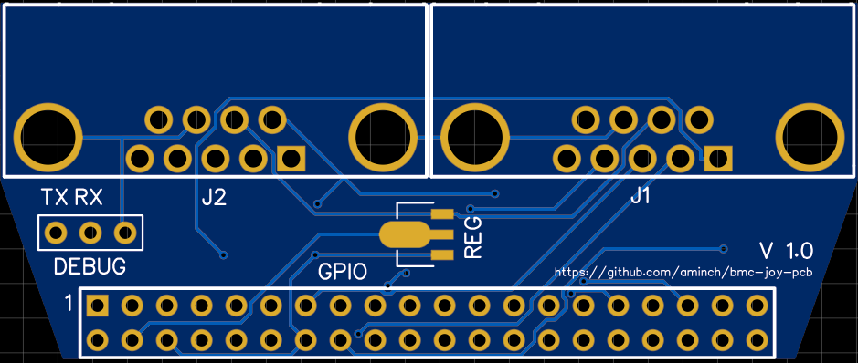
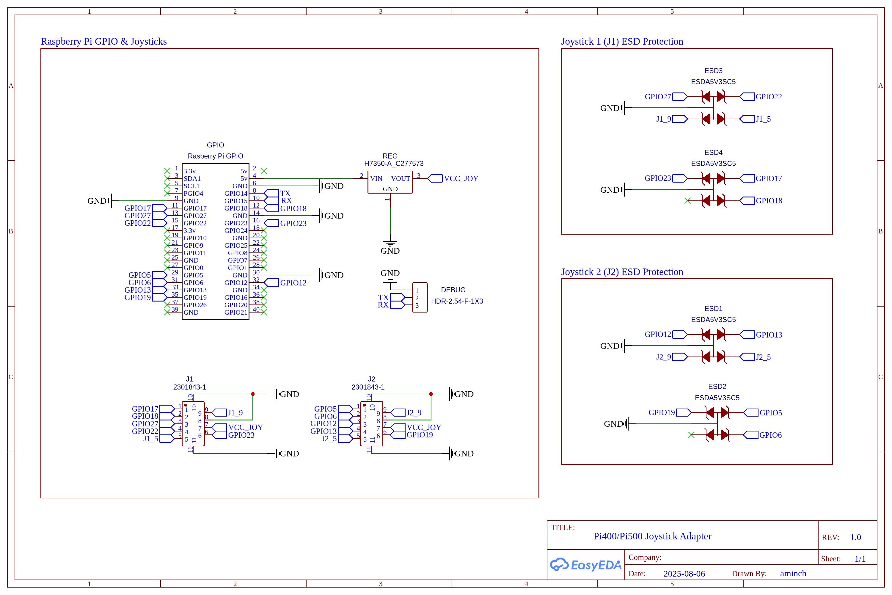
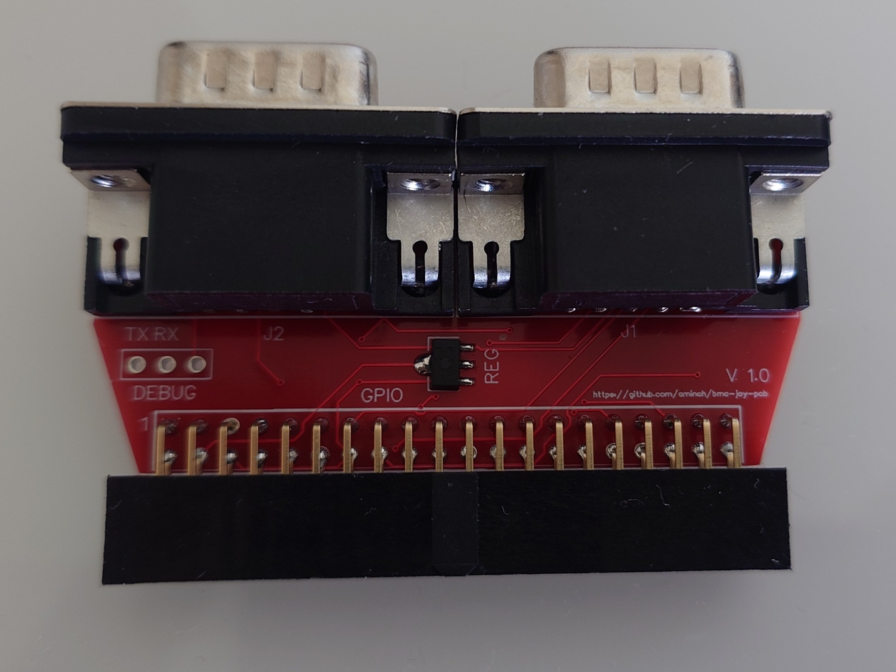
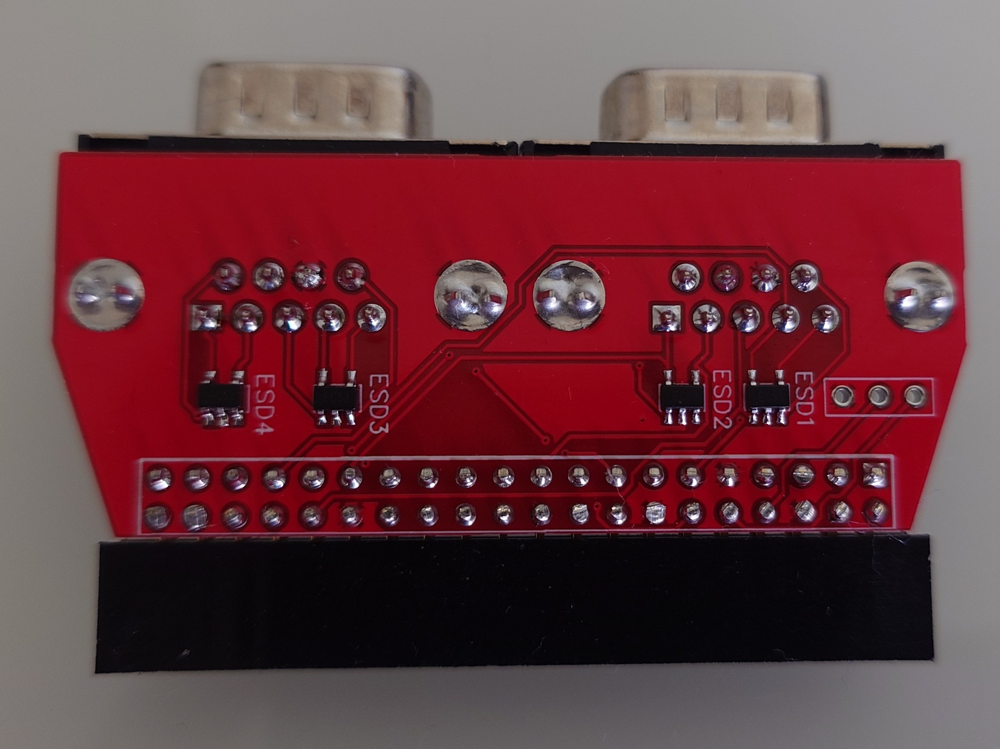

# BMC Joy PCB

The BMC Joy PCB is a compact joystick adapter board that brings classic DB9 joystick ports (Atari / Commodore style) to modern Raspberry Pi based retro builds. It is aimed at:

* [BMC64](https://accentual.com/bmc64/) users who want authentic 1 or 2 joystick ports on a minimal build
* Pi 400 / Pi 500 / Pi 500+ users running VICE and want to connect original joysticks (See project: [8-bit PC Pi Compile](https://github.com/aminch/8-bit-pc-pi-compile))

All project assets (BOM, Gerbers, schematic, images) are included in this repository for DIY fabrication and personal experimentation.

- [BMC Joy PCB](#bmc-joy-pcb)
	- [PCBs & Parts](#pcbs--parts)
		- [Main PCB](#main-pcb)
		- [BOM](#bom)
		- [Ordering PCBs](#ordering-pcbs)
		- [Schematics](#schematics)
	- [Assembly](#assembly)
	- [Software](#software)
	- [History](#history)
	- [Disclaimer](#disclaimer)

---

## PCBs & Parts

### Main PCB

### BOM

Full [BOM](bom/bom.md) of parts needed.

### Ordering PCBs

Use the Gerber archive in `gerbers/` to order boards from your preferred fab (e.g. JLCPCB, PCBWay, OSH Park). I ordered with standard settings of 1.6mm thick PCB.

### Schematics

---

## Assembly

Assemply is easiest, by first soldering the small SMD components then the large connectors.

1. Solder the 4 TVS (TCS) diodes on the bottom of the board.
2. Flip the board and solder the regulator.
3. Solder the GPIO header, making sure it's in line and level with the board.
4. Now solder the 2 joystick (DB9) ports.
5. Optionally you can solder a header to the debug port if you want to use it.

The assebled adapter should look like below:

| Top | Bottom |
| --- | --- |
|  |  |

## Software

This adapter has been designed to be used on a Pi 400, Pi 500 or Pi 500+ with the project: [8-bit PC Pi Compile](https://github.com/aminch/8-bit-pc-pi-compile). It uses the same GPIO configuration as [GPIO Config 1](https://github.com/randyrossi/bmc64?tab=readme-ov-file#gpio-config-1--menu-nav-buttons-and-joysticks) in the BMC64 project so that the adapter is directly compatible with both.

### BMC64

When using [BMC64](https://accentual.com/bmc64/), enable [GPIO Config 1](https://github.com/randyrossi/bmc64?tab=readme-ov-file#gpio-config-1--menu-nav-buttons-and-joysticks), and you're good to go!

### VICE on PiOS Lite (Pi 400 / Pi 500 / Pi 500+)

Follow the instructions to set up PiOS and Vice from this project: [8-bit PC Pi Compile](https://github.com/aminch/8-bit-pc-pi-compile)

This uses the dtoverlay `gpio-key` to map keyboard keys to GPIO pins, then those keyboard keys are mapped to joystick actions within Vice. This is all done for you in the project above.

---

## History

### 1.0 (2025-08)

Initial release of the board & assets:

---

## Disclaimer

This is a hobby project provided for educational and personal use only. I am not an electrical engineer, fabricate and use at your own risk. Always verify connections before powering your Raspberry Pi. No warranty is expressed or implied. Trademarks are property of their respective owners.

---

If you build one, feel free to open an Issue or PR with suggestion or improvements. Enjoy bringing classic joystick feel to your modern Pi setup!
